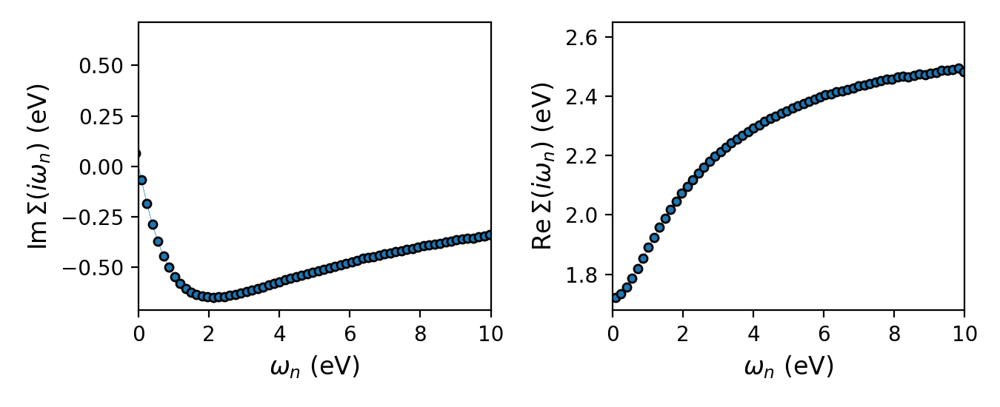
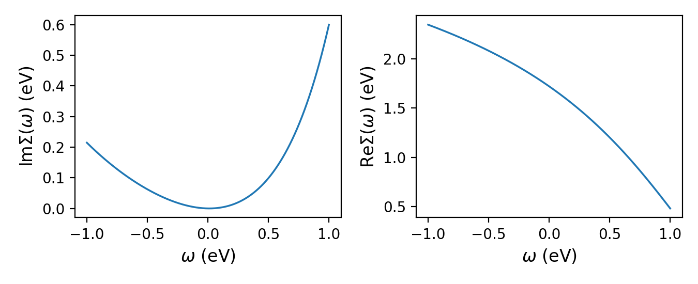
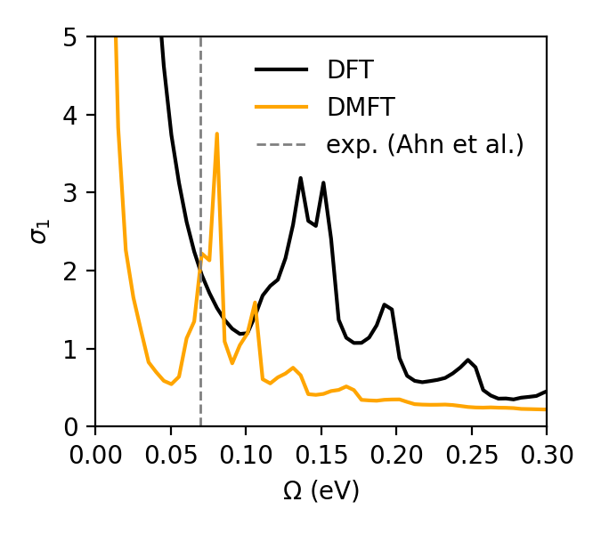

.. _tutorial_svo_optics:

Optical conductivity of SrVO\ :sub:`3`
**************************************

This tutorial walks through a full DFT + DMFT calculation (one-shot) of the optical
conductivity of the prototypical correlated metal SrVO\ :sub:`3`, using
ModEST's Kubo-bubble transport post-processing. The goal is to reproduce the
central result of

    G. Ahn, M. Zingl, S. J. Noh, M. Brahlek, J. D. Roth, R. Engel-Herbert,
    A. J. Millis, and S. J. Moon,
    *Low-energy interband transition in the infrared response of the correlated
    metal SrVO*\ :sub:`3` *in the ultraclean limit*,
    `Phys. Rev. B 106, 085133 (2022) <https://doi.org/10.1103/PhysRevB.106.085133>`_,

namely a **weak interband transition near 70 meV** in the optical conductivity
:math:`\sigma_1(\Omega)`. This feature sits below the intraband Drude response
and arises from transitions between the :math:`t_{2g}` bands that are split by
*orbital off-diagonal hopping* — a splitting that is renormalized by electronic
correlations and is easily buried under the Drude peak in more disordered
samples.

.. note::

   This is an *end-to-end* tutorial: it runs a DMFT loop with a
   continuous-time quantum Monte Carlo (CT-HYB) impurity solver, analytically
   continues the self-energy, and then evaluates the Kubo bubble. For the definitions, sign
   conventions, and **units** of every transport quantity, see
   :ref:`userguide_transport`.

Overview of the workflow
========================

The calculation has three stages, each a small script in this tutorial's
directory (``doc/tutorials/svo_optics``):

.. list-table::
   :header-rows: 1
   :widths: 18 30 52

   * - Stage
     - Script
     - Produces
   * - 1. DMFT loop
     - ``dmft.py``
     - the converged Matsubara self-energy :math:`\Sigma(i\omega_n)` and chemical
       potential :math:`\mu`, provided here as ``dmft_results.h5``
   * - 2. Continuation
     - ``plot.py``
     - the real-frequency self-energy :math:`\Sigma(\omega)` (Padé,
       double-counting removed), added to ``dmft_results.h5``
   * - 3. Optical conductivity
     - ``optics.py``
     - ``svo_dmft_optics.h5`` — the optical conductivity
       :math:`\sigma_1(\Omega)`

The calculation uses two DFT-derived archives, both produced from the same Wien2k
run with the Wien2k Converter provided by
`triqs_dftkit <https://triqs.github.io/dftkit/latest/>`_ but on **different k-meshes**:

* ``svo_dft_data.h5`` — the correlated :math:`t_{2g}` projectors and dispersion
  on the *coarse* k-mesh that the DMFT loop runs on. This archive also carries
  :math:`H(k)` along a high-symmetry path, used to plot the spectral function
  :math:`A(k,\omega)`.
* ``svo_dft_optics.h5`` — :math:`H(k)` and the band velocities :math:`v(k)`
  (``dft_transp_input``), regenerated on a *dense* mesh for the transport
  :math:`\mathbf{k}`-sum.

DFT input and projectors
========================

SrVO\ :sub:`3` is cubic (:math:`Pm\bar{3}m`) with a single V atom carrying a
partially-filled :math:`t_{2g}` shell. The Wien2k structure and the
``dmftproj`` projection window are:

.. literalinclude:: SrVO3.indmftpr

Running Wien2k + ``dmftproj`` and converting with the Wien2k Converter provided by
`triqs_dftkit <https://triqs.github.io/dftkit/latest/>`_ produces ``svo_dft_data.h5``
on the coarse DMFT k-mesh. For transport, the converter is re-run on a dense
:math:`79\times79\times79` mesh; its transport step additionally writes the band
velocities :math:`v(k)` into ``svo_dft_optics.h5``.

This DFT preparation is external to ModEST, and the converted archives are large.
To keep the tutorial directory lightweight we do not ship them; instead we provide
the Wien2k input files and only the compact archives needed to regenerate the
figures below — the converged DMFT results (:math:`\mu` and
:math:`\Sigma(i\omega_n)`) and the transport result (:math:`\sigma_1(\Omega)`):

* inputs: :download:`SrVO3.struct <SrVO3.struct>`,
  :download:`SrVO3.indmftpr <SrVO3.indmftpr>`
* scripts: :download:`dmft.py <dmft.py>`, :download:`plot.py <plot.py>`,
  :download:`optics.py <optics.py>`
* data: :download:`dmft_results.h5 <dmft_results.h5>`,
  :download:`svo_dmft_optics.h5 <svo_dmft_optics.h5>`

Stage 1 — the DMFT loop
=======================

The DMFT loop is a standard calculation: build the one-body elements
from the DFT archive, set up the embedding, and iterate the CT-HYB solver until
the local density converges. A Kanamori interaction with
:math:`U = 4.5`\ eV, :math:`J = 0.68`\ eV at :math:`\beta = 40`\ eV\ :sup:`-1`
is used, with a nominal (fully-localized-limit-like) double counting.

.. literalinclude:: dmft.py
   :language: python

The pieces are:

* :py:func:`~triqs_modest.obe.one_body_elements_from_dft_converter` loads the
  :math:`t_{2g}` projectors and dispersion;
* :py:func:`~triqs_modest.embedding.make_embedding` builds the map between the
  correlated subspace and the single impurity;
* :py:func:`~triqs_modest.rho_and_mu.find_chemical_potential`,
  :py:func:`~triqs_modest.local_gf.gloc`, and
  :py:func:`~triqs_modest.atomic_levels_and_delta.hybridization` produce the
  impurity input each iteration;
* the converged :math:`\mu` and :math:`\Sigma(i\omega_n)` are saved to the
  provided HDF5 archive.

The converged Matsubara self-energy is a smooth, Fermi-liquid-like function
below (a small imaginary part at low frequency, a linear real part setting the
quasiparticle renormalization):

.. note::

   ``dmft.py`` reads the coarse-mesh DFT archive ``svo_dft_data.h5``, which is not
   shipped with the tutorial (see above). To follow along without it, start from the
   provided ``dmft_results.h5`` — it already holds the converged
   :math:`\Sigma(i\omega_n)` and :math:`\mu` — and skip straight to Stage 2.

Stage 2 — analytic continuation
===============================

Transport requires the self-energy on the real-frequency axis. We build it by
Padé continuation of the converged :math:`\Sigma(i\omega_n)`.

.. literalinclude:: plot.py
   :language: python
   :start-at: w_min, w_max
   :end-before: om = np.fromiter(Sigma_w.mesh, float)

``plot.py`` reads :math:`\Sigma(i\omega_n)` and :math:`\mu` from ``dmft_results.h5``
and writes the continued ``Sigma_w_m_dc`` back into it. Padé is delicate; a smooth
low-energy :math:`\mathrm{Im}\,\Sigma(\omega)`
with a quasiparticle dip at :math:`\omega = 0` indicates a sensible
continuation:

Stage 3 — optical conductivity
==============================

With :math:`\Sigma(\omega)` and :math:`\mu` in hand, the transport calculation
is two steps (see :ref:`userguide_transport`): the expensive, MPI-parallel
:math:`\mathbf{k}`-sum that builds the transport distribution
:math:`\Gamma_{xx}(\omega,\Omega)`, followed by the cheap Onsager moments integration.
The velocities and cell volume are loaded with ``read_velocities=True``.

.. literalinclude:: optics.py
   :language: python

Note the two calls:

* :py:func:`~triqs_modest.bubble.transport_distribution` evaluates the Kubo
  bubble on the external mesh ``Om_mesh`` (here :math:`\Omega \in [0, 0.5]`\ eV,
  which brackets the 70 meV feature). Because :math:`\Sigma(\omega)` already
  supplies the scattering, ``broadening`` is set to zero.
* :py:func:`~triqs_modest.optics.optical_conductivity` integrates :math:`\Gamma`
  into :math:`\sigma_1(\Omega)` (in :math:`10^{3}\,\Omega^{-1}\mathrm{cm}^{-1}`).

Running under MPI parallelizes the :math:`\mathbf{k}`-sum::

    mpirun -n 8 python optics.py

The result
==========

Zooming into the low-energy region reveals the target feature: a weak peak in
:math:`\sigma_1(\Omega)` near :math:`\Omega \approx 70`\ meV, distinct from the
intraband Drude response that diverges as :math:`\Omega \to 0` (off-scale here,
:math:`\sim 1.6\times10^{4}` in the same units).

This peak is the interband transition identified in
`Phys. Rev. B 106, 085133 <https://doi.org/10.1103/PhysRevB.106.085133>`_:
transitions between :math:`t_{2g}` bands split by orbital off-diagonal hopping.
Its position and weight are set by the *correlated* band structure. The DMFT
self-energy renormalizes the splitting. 