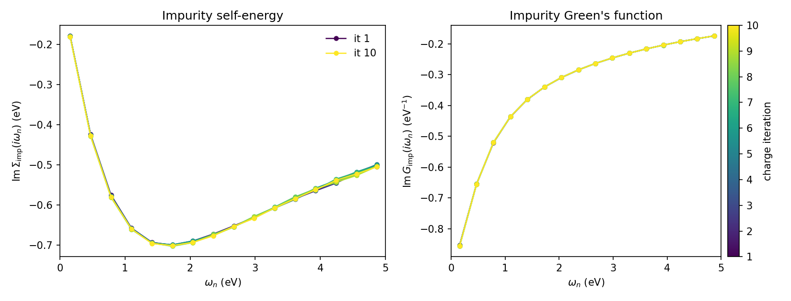

.. _svo_csc:

Charge self-consistent DFT+DMFT with VASP: SrVO\ :sub:`3`
=========================================================

This tutorial walks through a full charge self-consistent (CSC) DFT+DMFT
calculation for the prototypical correlated metal SrVO\ :sub:`3`, using the
:program:`VASP` driver shipped with `dftkit <https://github.com/triqs/dftkit>`_
together with :program:`modest`. We treat the vanadium :math:`t_{2g}` manifold
as the correlated subspace, solve the impurity problem with the CT-SEG solver
from `triqs_ctseg <https://github.com/triqs/ctseg>`_, and feed the resulting
charge-density correction back into :program:`VASP` until self-consistency.

SrVO\ :sub:`3` is the textbook moderately-correlated metal of DMFT: a single
electron in the three vanadium :math:`t_{2g}` orbitals (:math:`d^1`) that, with
a realistic :math:`U = 4.5` eV and :math:`J = 0.65` eV, develops a renormalized
quasi-particle (:math:`Z \approx 0.6`) on top of the DFT band structure. It
stays metallic, which is exactly what the self-energy plot below shows.

Unlike the older ``vasp_dmft`` work flow, the whole calculation is driven by a
single Python script: the dftkit VASP ``Driver`` keeps one
:program:`VASP` process alive in the background, exchanges the Kohn-Sham
Hamiltonian, projectors and charge-density correction through the
``vaspout.h5`` / ``vaspgamma.h5`` interface, and runs the PLOVasp projector
construction internally. No source-code patching and no auxiliary shell script
are needed.

.. note::

   This example requires :program:`VASP` 6.5.0 or newer, built with HDF5
   support enabled, plus the TRIQS applications ``triqs_modest``,
   ``triqs_dftkit`` and ``triqs_ctseg``.

All input files are collected in the tutorial directory:
:download:`POSCAR <./POSCAR>`, :download:`INCAR.scf <./INCAR.scf>`,
:download:`INCAR <./INCAR>`, :download:`plo.cfg <./plo.cfg>`,
:download:`vasp_modest_csc.py <./vasp_modest_csc.py>` and
:download:`plot_sigma.py <./plot_sigma.py>`. You have to provide your own
:file:`POTCAR` (``Sr_sv``, ``V_sv`` and ``O``).

Step 1 — converge the DFT charge density
-----------------------------------------

We start from the simple cubic SrVO\ :sub:`3` cell:

.. literalinclude:: POSCAR

Run a plain DFT calculation first to obtain a converged charge density. We use
the :file:`INCAR.scf` below; the k-mesh is set automatically through
``KSPACING`` so no :file:`KPOINTS` file is required.

.. literalinclude:: INCAR.scf

``LORBIT = 14`` lets :program:`VASP` optimize the localized projector channels
inside the energy window defined by ``EMIN`` / ``EMAX``, and the single
``LOCPROJ`` line selects the vanadium :math:`d` states (atom 2 in the
``POSCAR``). The projectors are written to ``vaspout.h5``.

Run :program:`VASP` in a dedicated directory and keep the resulting
:file:`CHGCAR` (and :file:`WAVECAR`); the CSC run below reads them as its
starting point.

Step 2 — the projector definition
----------------------------------

The correlated subspace is configured for PLOVasp through :file:`plo.cfg`:

.. literalinclude:: plo.cfg

We define a single shell (``LSHELL = 2``, i.e. :math:`d`) on the vanadium ion
(``IONS = 2``) and normalize the projectors inside the energy window
``EWINDOW``. The ``TRANSFORM`` matrix picks the three :math:`t_{2g}` orbitals
(:math:`d_{xy}, d_{yz}, d_{xz}`) out of the five :math:`d` orbitals, which are
the only correlated degrees of freedom for cubic SrVO\ :sub:`3`. The driver
runs PLOVasp with this file on every charge iteration; you do not call the
converter yourself.

Step 3 — switch the INCAR to charge self-consistency
----------------------------------------------------

For the CSC run we read the converged density and let :program:`VASP` wait for
the DMFT charge update at every electronic step:

.. literalinclude:: INCAR

The key additions over the plain SCF run are ``ICHARG = 5`` (read the charge
density and apply the external correction), a very large ``NELM`` / ``NELMIN``
so that VASP never stops on its own, and the conservative mixing
(``IMIX``/``AMIX``/``BMIX``) that stabilizes the charge update. ``LSYNCH5 =
True`` routes the projectors and the charge-density correction through
``vaspout.h5`` / ``vaspgamma.h5``; from VASP 6.5.0 onwards this replaces the
text-based ``GAMMA`` interface and needs no changes to the VASP source.

Copy the converged :file:`CHGCAR` and :file:`WAVECAR` from Step 1, this
:file:`INCAR`, the :file:`POSCAR`, your :file:`POTCAR` and :file:`plo.cfg` into
a fresh working directory.

Step 4 — the DMFT driver script
--------------------------------

The complete CSC loop is implemented in :download:`vasp_modest_csc.py
<./vasp_modest_csc.py>`:

.. literalinclude:: vasp_modest_csc.py
   :language: python

A few points worth highlighting:

* The :program:`VASP` driver is wrapped in the :program:`modest`
  ``DftDriver``. The ``MPIHandler`` controls how :program:`VASP` is
  launched (here ``mpirun -np 16``), independently of how many ranks run the
  Python/solver part::

      driver = DftDriver(VaspDriver(seedname="vasp", plo_cfg="plo.cfg",
                                    mpi_handler=MPIHandler(mpi_exec="mpirun -np 16"),
                                    vasp_command="vasp_std"))

* ``one_body_elements_from_dft`` performs the initial DFT step, runs the
  PLOVasp conversion and returns the target electron count together with the
  one-body elements (the Kohn-Sham Hamiltonian and the projectors). From these
  we build the embedding, the local Kanamori interaction
  (:math:`U = 4.5`, :math:`J = 0.65` eV) and the fully-localized-limit double
  counting. We work at an inverse temperature :math:`\beta = 20` eV\
  :sup:`-1`.

* The calculation is organized as **two nested loops**. The outer loop
  (``n_total_loops``) performs one DFT charge update per iteration; the inner
  loop (``n_dmft_loops``) is the DMFT self-consistency cycle for the current
  Kohn-Sham Hamiltonian. The first outer iteration runs a few extra DMFT cycles
  to converge the self-energy before the first charge update.

* After each DMFT cycle the charge-density correction is computed with
  ``charge_density_correction`` and handed back to VASP via
  ::

      obe = driver.update_one_body_elements_with_charge_correction(N_k, Eint_m_dc)[1]

  which triggers the next VASP charge update and returns the freshly converted
  one-body elements.

* Every outer iteration is appended to ``checkpoint.h5`` under ``it=<n>``,
  including the impurity self-energy ``Sigma_iw`` that we track below (the
  impurity and local Green's functions ``Gimp_iw`` / ``Gloc_iw`` are stored as
  well). The run always ends on a DMFT step — the charge update is skipped on
  the last outer iteration.

Step 5 — run it
---------------

Load the environment and launch the script under MPI. The Python/solver part
runs on 32 ranks here, while :program:`VASP` is launched separately on 16 ranks
by the driver::

    mpirun -n 32 python vasp_modest_csc.py 1>log 2>err

For meaningful CT-SEG statistics use at least a few tens of cores. The whole
ten-iteration run takes a few minutes on a single modern node.

Step 6 — track the impurity self-energy
---------------------------------------

To monitor convergence we follow the impurity self-energy across the charge
iterations. The script :download:`plot_sigma.py <./plot_sigma.py>` reads
``checkpoint.h5`` and produces the figure below:

.. literalinclude:: plot_sigma.py
   :language: python

So that the figure can be reproduced without rerunning the (compute-heavy) CSC
loop, a small reference archive
:download:`checkpoint_ref.h5 <./checkpoint_ref.h5>` holding the ``Sigma_iw``,
``Gimp_iw`` and ``mu`` of the converged run is shipped with the tutorial. Pass
it on the command line to regenerate the plot directly::

    python plot_sigma.py checkpoint_ref.h5

Both panels show the low-frequency Matsubara window
:math:`0 < \omega_n < 5` eV, with one curve per charge iteration coloured from
the first (dark) to the last (light). The left panel is the imaginary part of
the impurity self-energy :math:`\mathrm{Im}\,\Sigma_\mathrm{imp}(i\omega_n)`;
its Fermi-liquid turnover — bending back towards zero as
:math:`\omega_n \to 0` — together with its slope near the origin
(:math:`Z \approx 0.6`) is the signature of the renormalized metal. The right
panel is the imaginary part of the impurity Green's function
:math:`\mathrm{Im}\,G_\mathrm{imp}(i\omega_n)`, which stays large down to the
lowest Matsubara frequency — i.e. substantial spectral weight at the Fermi
level, again confirming the metallic state. The curves for all ten charge
iterations lie essentially on top of each other, showing that the charge
self-consistency is converged.

.. note::

   **Why track the self-energy rather than** :math:`|G_\mathrm{imp} -
   G_\mathrm{loc}|`\ **?** The latter measures the *inner* DMFT self-consistency
   (:math:`G_\mathrm{imp} = G_\mathrm{loc}`), not the *charge* convergence of the
   outer loop. With a single DMFT cycle per charge update the impurity and local
   Green's functions are evaluated once within the same iteration and never
   iterated to coincide, so their difference is dominated by the stochastic
   CT-SEG noise and carries no trend. The self-energy, by contrast, feels the
   shift of the impurity levels as the charge density is updated and converges
   smoothly, which is why we follow it here.
